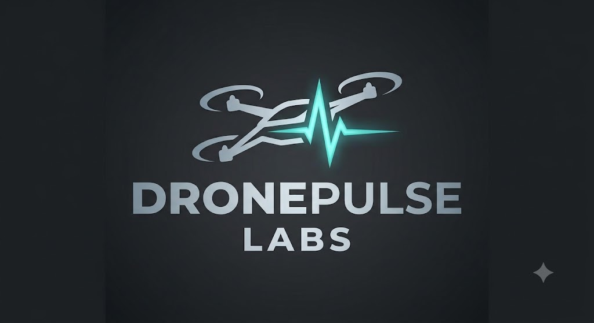

<div align="center">


<br/>
<br/>


<br/>
<br/>

### Production-Grade MAVLink Abstraction Engine for Autonomous Aerial Systems

[](https://pypi.org/project/easylink-mavlink/)
[](https://pypi.org/project/easylink-mavlink/)
[](docs/CPP_API.md)
[](LICENSE)
[]()

<br/>

[**Quickstart**](#-quickstart) · [**Python SDK**](#-python-sdk-py-easylink) · [**C++ Core**](#-c-core-easylink-cpp) · [**API Docs**](docs/) · [**Examples**](examples/) · [**Releases**](#-releases)

</div>

---

## The Problem

Building drone software on raw MAVLink means writing verbose, error-prone protocol-level code. Every command requires packing bitmasks, managing socket reads, parsing heartbeats, and handling firmware-specific quirks. A simple "arm and take off" operation turns into **25+ lines** of boilerplate.

## The Solution

**EASYLink** wraps the entire MAVLink protocol surface into clean, synchronous-first APIs that mirror MAVLink commands exactly — but in **1–2 lines** instead of 25. No magic. No opinions on how you fly. Just the same MAVLink operations, drastically simplified.

```python
# Raw pymavlink — 25+ lines of boilerplate
master.mav.command_long_send(target_sys, target_comp,
    mavutil.mavlink.MAV_CMD_COMPONENT_ARM_DISARM, 0, 1, 0, 0, 0, 0, 0, 0)
while True:
    msg = master.recv_match(type='HEARTBEAT', blocking=True, timeout=0.5)
    if msg and (msg.base_mode & mavutil.mavlink.MAV_MODE_FLAG_SAFETY_ARMED):
        break
master.mav.command_long_send(target_sys, target_comp,
    mavutil.mavlink.MAV_CMD_NAV_TAKEOFF, 0, 0, 0, 0, 0, 0, 0, 10)
```

```python
# EASYLink — Same MAVLink commands underneath. Two lines.
drone.arm()
drone.takeoff(10.0)
```

---

## 🧬 Architecture

```
       ┌─────────────────────────────────────────────────────┐
       │                 Your Application                    │
       └──────────────────────┬──────────────────────────────┘
                              │
                ┌─────────────┴─────────────┐
                │                           │
                ▼                           ▼
       ┌─────────────────┐        ┌─────────────────┐
       │  PY-EASYLink    │        │  EASYLink-CPP    │
       │  Python SDK     │        │  C++17 Library   │
       │  (PyPI wheel)   │        │  (CMake static)  │
       └────────┬────────┘        └────────┬────────┘
                │                          │
                └────────────┬─────────────┘
                             │
                             ▼
       ┌─────────────────────────────────────────────────────┐
       │         MAVLink v2 Protocol Layer                   │
       │         (ArduPilot  ·  PX4  ·  Auto-Detected)      │
       └──────────────────────┬──────────────────────────────┘
                              │
                              ▼
       ┌─────────────────────────────────────────────────────┐
       │         Vehicle  (SITL Simulator / Hardware)        │
       └─────────────────────────────────────────────────────┘
```

---

## ⚡ Command Mapping

Every EASYLink method maps **directly** to a MAVLink command or message. No abstraction leaks.

| Operation | MAVLink Command / Message | EASYLink |
| :--- | :--- | :--- |
| **Arm Motors** | `MAV_CMD_COMPONENT_ARM_DISARM` (param1=1) | `drone.arm()` |
| **Disarm Motors** | `MAV_CMD_COMPONENT_ARM_DISARM` (param1=0) | `drone.disarm()` |
| **Takeoff** | `MAV_CMD_NAV_TAKEOFF` (param7=alt) | `drone.takeoff(alt)` |
| **Land** | `MAV_CMD_NAV_LAND` | `drone.land()` |
| **Return to Launch** | `MAV_CMD_DO_SET_MODE` → RTL | `drone.home()` |
| **GPS Navigate** | `MAV_CMD_DO_REPOSITION` | `drone.goto(lat, lon, alt)` |
| **Relative Move** | `SET_POSITION_TARGET_LOCAL_NED` | `drone.goto_relative(n, e, d)` |
| **Change Speed** | `MAV_CMD_DO_CHANGE_SPEED` | `drone.set_speed(m_s)` |
| **Set Heading** | `MAV_CMD_CONDITION_YAW` | `drone.set_heading(deg)` |
| **Orbit** | `MAV_CMD_DO_ORBIT` | `drone.orbit(radius, speed)` |
| **Emergency Kill** | `MAV_CMD_COMPONENT_ARM_DISARM` (param2=21196) | `drone.kill()` |
| **Read Parameter** | `PARAM_REQUEST_READ` → `PARAM_VALUE` | `drone.params.get("NAME")` |
| **Write Parameter** | `PARAM_SET` → `PARAM_VALUE` | `drone.params.set("NAME", val)` |
| **Upload Mission** | Mission microservice handshake protocol | `drone.mission.upload()` |
| **Start Mission** | `MAV_CMD_MISSION_START` + AUTO mode | `drone.mission.start()` |
| **Read Telemetry** | `GLOBAL_POSITION_INT` / `ATTITUDE` / `SYS_STATUS` | `drone.position` / `.attitude` / `.battery` |

---

## 🚀 Quickstart

### Python

```bash
pip install easylink-mavlink
```

```python
from easylink import Drone

drone = Drone()
drone.connect()

drone.arm()
drone.takeoff(10.0)

pos = drone.position
print(f"Altitude: {pos.alt}m | GPS: {pos.lat}, {pos.lon}")

drone.hover(5.0)
drone.home(blocking=True)   # Blocks until vehicle lands & disarms
drone.disconnect()
```

### C++

```cpp
#include <easylink/drone.hpp>

int main() {
    easylink::Drone drone("udp:127.0.0.1:14550");
    drone.connect();

    drone.arm();
    drone.takeoff(10.0f);

    auto pos = drone.position();
    std::cout << "Alt: " << pos.alt << "m" << std::endl;

    drone.hover(5.0f);
    drone.home();
    drone.disconnect();
}
```

### Fluent Mission Builder

```python
drone.mission.clear() \
     .add_takeoff(alt=15.0) \
     .add_waypoint(22.5039, 88.2937, 15.0) \
     .add_waypoint(22.5040, 88.2938, 20.0) \
     .add_land()

drone.mission.upload()
drone.arm()
drone.mission.start(blocking=True)   # Blocks until mission completes
```

---

## 🐍 Python SDK (`PY-EASYLink`)

Distributed on PyPI as **compiled C-extension binary wheels** (`.pyd` / `.so`).  
Source code is not exposed in the installed package.

```bash
pip install easylink-mavlink
```

**Requirements**: Python ≥ 3.8 · `pymavlink ≥ 2.4.41` (auto-installed)

📖 **Full Reference**: [Python API Documentation](docs/PYTHON_API.md)

---

## ⚡ C++ Core (`EASYLink-CPP`)

C++17 static library with zero dependencies beyond MAVLink C headers (auto-fetched via CMake `FetchContent`).

```bash
cd EASYLink-CPP && mkdir build && cd build
cmake .. && cmake --build .
```

📖 **Full Reference**: [C++ API Documentation](docs/CPP_API.md)

---

## 📦 Releases

| Package | Platform | Install | Link |
| :--- | :--- | :--- | :--- |
| `easylink-mavlink` | Python ≥ 3.8 | `pip install easylink-mavlink` | [PyPI →](https://pypi.org/project/easylink-mavlink/) |
| `easylink-cpp` | C++17 (CMake) | CMake FetchContent | [Docs →](docs/CPP_API.md) |

---

## 📂 Repository Structure

```
EASYLink/
├── public/                  # Brand assets
│   ├── DronePulseHeader.jpg
│   ├── DronePulseLabs.jpg
│   └── EASYLink.png
├── docs/                    # API reference documentation
│   ├── PYTHON_API.md
│   └── CPP_API.md
├── examples/                # Runnable code samples
│   ├── python/
│   │   ├── 01_basic_flight.py
│   │   └── 02_mission_flight.py
│   └── cpp/
│       └── 01_basic_flight.cpp
├── README.md
└── LICENSE
```

---

## 📑 Documentation

| Document | Description |
| :--- | :--- |
| [Python API Reference](docs/PYTHON_API.md) | Full method signatures, telemetry properties, event system |
| [C++ API Reference](docs/CPP_API.md) | Header-level API, types, build integration |
| [Python Examples](examples/python/) | Ready-to-run flight scripts |
| [C++ Examples](examples/cpp/) | Compilable flight applications |

---

## ⚠️ Safety & Legal Disclaimer

> **IMPORTANT**: Autonomous and remotely piloted aerial systems involve inherent operational risks to property, personnel, and airspace safety.

1. **Use at Your Own Risk**: `EASYLink` is provided on an **"AS IS"** and **"AS AVAILABLE"** basis without warranties of any kind, whether express, implied, statutory, or otherwise, including but not limited to warranties of merchantability, fitness for a particular purpose, or non-infringement.
2. **No Operational Liability**: Under no circumstances shall **TheDronePulseLab**, its authors, maintainers, or contributors be held liable for any direct, indirect, incidental, special, consequential, or punitive damages (including, without limitation, vehicle crashes, hardware damage, loss of control, flight controller failure, property damage, personal injury, or regulatory fines) arising out of the use or inability to use this software.
3. **Operator Responsibility**: The pilot in command / software operator assumes **100% full responsibility** for:
   - Thoroughly testing all flight scripts in safe SITL simulation environments prior to real hardware deployment.
   - Maintaining physical manual override controls (RC Transmitter / Hardware Kill Switch) at all times during flight.
   - Ensuring strict compliance with applicable civil aviation rules and regulations (FAA, EASA, DGCA, etc.) in your flight jurisdiction.

---

<div align="center">

<br/>



<br/>

**DronePulse Labs** · *Skies of the Future*

[GitHub](https://github.com/TheDronePulseLab) · [Contact](mailto:dronepulselabs@gmail.com)

<br/>

<sub>Released under the MIT License · Copyright © 2026 DronePulse Labs</sub>

</div>
